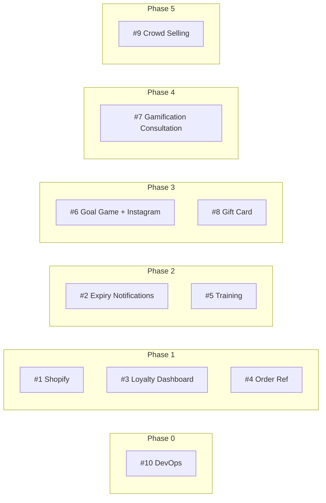

# MHG Scope Features Planning

## 1. Introduction

This document plans the scope features from the BlockTechBrew technical proposal within the context of the existing MHG mobile app feature set. It maps each proposed work item to the app’s feature list, classifies the type of work, and aligns delivery with the recommended phasing.

**Sources**

- **MHG Mobile App Feature List** — existing capabilities (User Auth, Home, Product Browsing, Search, Cart, Wishlist, Checkout & Payment, Order Management, Profile, Rewards & Loyalty, Categories, Store Locator, Notifications, Settings, Swipe/Gamification, etc.).
- **MHG Project Proposal BlockTechBrew** (February 2026, v1.0) — scope to implement: 9 feature/bug/training/consultation items plus 1 infrastructure workstream.

**Audience**

Product, development, and QA teams using this as the single reference for “what scope lands where” in the app.

---

## 2. Scope-to-App Mapping Table

| Proposal # | Scope Item | Type | App Feature Area(s) from Feature List |
|------------|------------|------|--------------------------------------|
| 1 | Shopify "No Customer" bug | Bug Fix | §8 Order Management (backend/sync); no direct mobile UI |
| 2 | Loyalty points expiry notifications | New Feature | §10 Rewards & Loyalty; §13 Notifications |
| 3 | Customer loyalty data dashboard | Enhancement | §10 Rewards & Loyalty; Admin (backend) |
| 4 | Order reference in loyalty transactions | Enhancement | §10 Rewards & Loyalty; §8 Order Management |
| 5 | Push notification setup training | Training | §13 Notifications; Operations |
| 6 | Goal game (5 balls) + Instagram login | New Feature | §15 Swipe / Gamification; §1 User Authentication (Social Login) |
| 7 | Gamification proposals (ST → MHG) | Consultation | §15 Additional Features (Swipe); §10 Gamification |
| 8 | Digital gift card (Shopify + F&B) | New Feature | §7 Checkout & Payment (Gift Cards); new Gift Card wallet/flow |
| 9 | Crowd selling (eBay-like) | New Module | New: Marketplace tab; ties to §7 Checkout, §8 Orders, §13 Notifications |
| 10 | Code improvement, CI/CD, QA, monitoring | Infrastructure | Cross-cutting: all app areas |

*Section references (§) align with the MHG Mobile App Feature List PDF (e.g. §1 User Authentication, §7 Checkout & Payment, §10 Rewards & Loyalty).*

---

## 3. Per-Scope-Item Planning

### 3.1 — Feature 01: Shopify "No Customer" Bug Fix

**Type:** Bug Fix

**Relevant existing features**

- §8 Order Management (order sync to Shopify)
- Order list, order status, order details, tracking

**What’s new vs enhanced**

- No new user-facing features. Fixes existing behavior: orders synced from MHG to Shopify will have customer data attached so they are no longer orphaned in Shopify.

**Main deliverables**

- **Backend:** Audit and fix Shopify order sync (ShopifyHelper, sync controller); add validation and logging; backfill script for orphaned orders.
- **Mobile:** None.
- **Admin/Operations:** Improved Shopify dashboard accuracy; optional manual review queue for edge cases.

**Dependencies**

- None. Can be delivered first to improve data integrity for reporting and CRM.

---

### 3.2 — Feature 02: Automated Push Notification for Nearly Expiring Loyalty Points

**Type:** New Feature

**Relevant existing features**

- §10 Rewards & Loyalty: Loyalty Points (Hearts), Points History, Points Expiry, Tier Benefits
- §13 Notifications: Push Notifications, Notification Center, Notification Settings

**What’s new vs enhanced**

- **New:** Automated expiry-reminder notifications (first at 90 days before expiry, then every 2 weeks); deep link to Rewards screen; per-batch expiration display in rewards dashboard.
- **Enhanced:** Notification handler supports new `loyalty_expiry_reminder` type; rewards UI shows batch-level expiry.

**Main deliverables**

- **Backend:** Artisan command `CheckExpiringPoints` (daily schedule); `notification_logs` table; FCM integration; bilingual templates; admin view for delivery history and configurable intervals.
- **Mobile:** Handle new notification type; deep link to Rewards; show point-batch expiration dates in rewards screen.
- **Admin:** Notification delivery history and interval configuration.

**Dependencies**

- #4 (Order reference in loyalty transactions) improves traceability of points; #3 (Loyalty data dashboard) supports admin visibility. Best delivered after Phase 1.

---

### 3.3 — Feature 03: Customer Loyalty Data Dashboard with Expiration Dates

**Type:** Enhancement

**Relevant existing features**

- §10 Rewards & Loyalty: Current Tier, Loyalty Points, Points Progress, Points History, Reward Levels, Points Expiry

**What’s new vs enhanced**

- **New:** Admin loyalty data dashboard with tabular view, filters, and Excel/CSV export (D365-compatible); API endpoint for customer loyalty data with date range and tier filters.
- **Enhanced:** Mobile rewards screen shows per-batch expiration dates and transaction detail with expiry info.

**Main deliverables**

- **Backend:** `GET /api/v2/loyalty/customer-data`; admin Loyalty Data Dashboard page; export class (Maatwebsite Excel); pagination and performance tuning.
- **Mobile:** Display point-batch expiration in rewards screen; transaction detail view with expiry per batch.
- **Admin:** New dashboard page with search, date/tier filters, and export.

**Dependencies**

- None. Complements #4 for full loyalty data visibility.

---

### 3.4 — Feature 04: MHG Order Reference in Loyalty Transactions

**Type:** Enhancement

**Relevant existing features**

- §10 Rewards & Loyalty: Points History, Earn Points, Redeem Points
- §8 Order Management: Order list, order details, order number

**What’s new vs enhanced**

- **New:** Each loyalty earning/redemption is linked to an order (`order_id` on loyalty transactions); order reference visible in admin and mobile.
- **Enhanced:** Points history in app shows order number; tappable link to order detail. Admin loyalty transaction list shows clickable order link.

**Main deliverables**

- **Backend:** Migration adding `order_id` to loyalty transactions; loyalty earning logic updated to attach order; API resource includes order reference; backfill script; admin filter by order.
- **Mobile:** Show order reference in points history; tap to open order detail.
- **Admin:** Order link and filter in loyalty transaction views.

**Dependencies**

- None. Foundation for #2 (expiry notifications) and clearer support/audit.

---

### 3.5 — Feature 05: Push Notification Setup Training

**Type:** Training

**Relevant existing features**

- §13 Notifications: Push Notifications, Notification Settings, Notification Center

**What’s new vs enhanced**

- No app or backend code changes. Enables MHG team to manage push notifications independently.

**Main deliverables**

- **Backend/Operations:** Training document (PDF) for all notification types and admin controls; Firebase Console guide; admin walkthrough with screenshots; bilingual template guide; live training session (up to 2 hours); Q&A and troubleshooting guide.
- **Mobile:** None.

**Dependencies**

- Most valuable after #2 (expiry notifications) is live so training covers the new flow.

---

### 3.6 — Feature 06: Goal Game (5 Balls) + Instagram Login

**Type:** New Feature

**Relevant existing features**

- §15 Swipe / Gamification: Product swiping, goal game (existing ball configuration), gamification features
- §1 User Authentication: Social Login (Google, Facebook, Apple Sign In)

**What’s new vs enhanced**

- **New:** Instagram as a social login option; 5-ball goal game (configurable ball count, scoring, physics).
- **Enhanced:** Goal game UI and validation updated for 5 balls; auth screens and onboarding include Instagram.

**Main deliverables**

- **Backend:** Game config for 5 balls and reward rules; Instagram OAuth (Socialite); `instagram_id` on User; callback and account-merge logic.
- **Mobile:** Goal game UI with 5 balls, physics, and result screen; Instagram login button and OAuth flow (webview or SDK); token storage and onboarding update.
- **Admin:** Instagram app config; game configuration.

**Dependencies**

- None. Delivered in Phase 3 with other user-facing features.

---

### 3.7 — Feature 07: Gamification Proposals (ST → MHG) Consultation

**Type:** Consultation

**Relevant existing features**

- §15 Additional Features (Swipe): Product swiping, goal game, gamification
- §10 Rewards & Loyalty: Gamification features, achievements, progress tracking

**What’s new vs enhanced**

- No direct implementation. Produces a feasibility and roadmap document for future gamification work.

**Main deliverables**

- **Backend:** Review of current gamification in codebase; technical feasibility per ST proposal; complexity and cost estimates; prioritized roadmap; presentation for MHG.
- **Mobile:** None.

**Dependencies**

- None. Can run in parallel with Phase 3; informs post–Phase 3 gamification priorities.

---

### 3.8 — Feature 08: Digital Gift Card (Shopify Integration) — F&B Set Menu

**Type:** New Feature

**Relevant existing features**

- §7 Checkout & Payment: Gift Cards (purchase and redeem), Payment Methods, Order Confirmation
- §20 Special Features: Gift Cards, Vouchers

**What’s new vs enhanced**

- **New:** Full digital gift card lifecycle: purchase (amount or F&B set menu), send, redeem online/in-store via QR; Shopify sync; gift card wallet in app; use as payment method at checkout.
- **Enhanced:** Existing gift card concept extended with Shopify API, F&B bundles, QR redemption, and email delivery.

**Main deliverables**

- **Backend:** GiftCard model extended for Shopify sync; F&B set menu product type; email templates (EN/AR); admin gift card dashboard; redemption tracking; QR generation; webhooks for Shopify updates.
- **Mobile:** Purchase flow (design, amount/set menu, recipient); gift card wallet with balance; QR screen for in-store redemption; Dynamic Links for sharing; checkout integration.
- **Admin:** Gift card management and sync status.

**Dependencies**

- None. Delivered in Phase 3.

---

### 3.9 — Feature 09: Crowd Selling (eBay-like Marketplace)

**Type:** New Module

**Relevant existing features**

- §7 Checkout & Payment: checkout flow, payment methods
- §8 Order Management: orders, tracking, cancel/return
- §13 Notifications: push notifications
- §4 Search: search and filters (pattern reused for marketplace listings)

**What’s new vs enhanced**

- **New:** Entire marketplace: seller registration/verification, listing CRUD, bidding engine, buy-now, seller dashboard, buyer protection, disputes, payouts, ratings/reviews, in-app messaging. New Marketplace tab/section in app.
- **Enhanced:** Checkout and payments reused for marketplace purchases; notifications extended for marketplace events (outbid, won, sold, dispute, payout).

**Main deliverables**

- **Backend:** Seller verification workflow; listing and bid APIs; bidding engine; buyer protection and dispute workflow; payout management; commission config; admin moderation, approval, and reporting; new DB tables (listings, bids, transactions, disputes, payouts, messages, reviews).
- **Mobile:** Marketplace tab; browse (grid/list, filters); listing creation (photos, description, price/auction); auction UI (timer, bid, alerts); seller dashboard; buyer flow via existing checkout; messaging; dispute flow; seller profile and ratings; push notifications for marketplace events.
- **Admin:** Moderation, listing approval, dispute handling, payout approval, reporting.

**Dependencies**

- Best delivered last (Phase 5) after core platform and loyalty/gift card work are stable.

---

### 3.10 — Feature 10: Code Improvement, CI/CD, Deployment & QA Processes

**Type:** Infrastructure

**Relevant existing features**

- All app areas (cross-cutting).

**What’s new vs enhanced**

- **New:** CI/CD pipelines (backend and mobile), deployment automation, staging, QA strategy and regression suite, API test collection, UAT framework, error/performance monitoring, structured logging, mobile crash reporting.
- **Enhanced:** Code quality (PHP/Flutter lint, standards, dependency/security audit); branch protection and deployment runbooks.

**Main deliverables**

- **Backend:** PHP CS Fixer/Pint; Larastan/PHPStan; CI (PHPUnit, lint, static analysis); deployment scripts and staging; migration/rollback strategy.
- **Mobile:** Flutter analyze/test in CI; versioned APK/IPA; release workflow.
- **DevOps/QA:** Test strategy doc; regression test plan; Postman/Insomnia collection for v2 APIs; UAT process; Sentry/equivalent; performance and uptime monitoring; alerting; documentation and runbooks.

**Dependencies**

- None. Phase 0; runs in parallel with Phase 1 and supports all later phases.

---

## 4. Implementation Phasing

Aligned with the BlockTechBrew proposal. Scope feature IDs and app areas are listed; optional “App impact” is included.

| Phase | Name | Scope Items | App Areas | App Impact |
|-------|------|-------------|-----------|------------|
| **0** | DevOps & Infrastructure | #10 | Cross-cutting | No user-visible change; better quality, releases, and monitoring. |
| **1** | Foundation & Data Integrity | #1, #3, #4 | §8 Orders, §10 Rewards, Admin | No new screens; Shopify orders have customer data; loyalty data and order references visible in admin and rewards. |
| **2** | Notification Infrastructure | #2, #5 | §10 Rewards, §13 Notifications | Users receive expiry reminders and can see batch expiry in Rewards; MHG team trained on push setup. |
| **3** | User-Facing Features | #6, #8 | §1 Auth, §15 Swipe/Gamification, §7 Gift Cards/Checkout | Instagram login; 5-ball goal game; full gift card purchase, wallet, QR redemption, and checkout. |
| **4** | Strategic Planning | #7 | §15 Swipe, §10 Gamification | Consultation only; roadmap for future gamification. |
| **5** | Marketplace Module | #9 | New Marketplace; §7 Checkout, §8 Orders, §13 Notifications | New Marketplace tab; buy/sell, bids, messaging, disputes, payouts. |

---

## 5. App-Area View

Which scope items affect each area of the app (by Feature List sections):

| App Area | Scope Items | Notes |
|----------|-------------|--------|
| **§1 User Authentication & Onboarding** | #6 | Instagram login added alongside Google, Facebook, Apple. |
| **§7 Checkout & Payment** | #8, #9 | Gift card as payment and full flow (#8); marketplace checkout reuses flow (#9). |
| **§8 Order Management** | #1, #4, #9 | #1 Shopify sync fix; #4 order reference in loyalty; #9 marketplace orders. |
| **§10 Rewards & Loyalty** | #2, #3, #4 | Expiry notifications (#2); loyalty dashboard/export (#3); order reference in transactions (#4). |
| **§13 Notifications** | #2, #5 | Expiry reminders (#2); push notification setup training (#5). |
| **§15 Gamification / Swipe** | #6, #7 | 5-ball goal game and Instagram (#6); gamification consultation (#7). |
| **New: Marketplace** | #9 | New tab and full P2P marketplace. |
| **New: Gift card wallet/redemption** | #8 | Wallet, QR, and redemption flows. |
| **Infrastructure (all areas)** | #10 | CI/CD, QA, monitoring, code quality. |

---

## 6. Summary

- **Total scope:** 10 items — 9 feature/bug/training/consultation items (#1–#9) and 1 infrastructure workstream (#10).
- **Proposal totals (reference):** Feature development ~542 hrs (backend $30/hr, mobile $25/hr); DevOps/QA infra 116 hrs @ $40/hr; 20% QA buffer. Full investment and phasing are in the BlockTechBrew proposal; this document does not change scope or costs.
- **Purpose of this document:** To plan *where* and *how* the scoped work lands in the MHG app (mapping, per-item planning, phasing, app-area view) for implementation and QA.

---

## Appendix: Phasing Overview (Mermaid)

