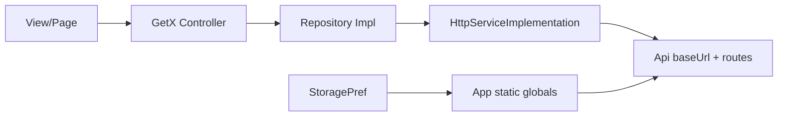

# MHG Flutter Application – Full Technical Audit Report

---

## 1. Project Architecture

**Architecture identified:** Feature-based structure with **GetX** (MVVM-like: View + Controller + Binding) and a **repository pattern** for data. Not strict Clean Architecture (no domain layer, use cases, or dependency inversion via abstractions injected from app layer).

**Folder structure:**

- **`lib/main.dart`** – Entry, `GetMaterialApp`, routes.
- **`lib/app/app.dart`** – App init (Firebase, GetStorage, dotenv, global state in `App.*`).
- **`lib/core/`** – API constants, HTTP service, routes, storage, models, languages, services (notifications, deep links).
- **`lib/features/<feature>/`** – Per feature: `binding/`, `controller/`, `repository/`, `view/pages/`, `view/widgets/`, `models/` where applicable.
- **`lib/constants/`**, **`lib/theme/`**, **`lib/widgets/`** – Shared UI and constants.

**Data flow (simplified):**

**Issues and recommendations:**

- **Global mutable state:** `App` holds token, countryId, currency, etc. as static mutable fields. Any code can read/write them; no single source of truth.
- **No domain layer:** Business rules live in controllers/repos. Introduce a thin domain (entities + repository interfaces) and inject implementations from a single composition root (e.g. initial binding or `main`).
- **Tight coupling:** Controllers/repos use `Get.find<T>()` and many repos call `Get.put(HttpServiceImplementation())` in `onInit`. Prefer constructor injection and one shared `HttpService` registration (e.g. in a root binding or `main`).
- **Feature structure is good:** Keep feature-based layout; consider `core/domain` and `core/data` for shared contracts and HTTP/client setup.

---

## 2. Dependency Analysis

**Source:** [pubspec.yaml](../pubspec.yaml)

**Dependencies (notable):**

- **get: ^4.6.5** – State management, routing, DI.
- **get_storage: ^2.1.1** – Key-value storage (unencrypted).
- **http: ^0.13.6** – HTTP client (no retry/interceptors; consider `dio` for retries, interceptors, logging).
- **dartz: ^0.10.1** – `Either` for error handling.
- **flutter_dotenv: ^5.1.0** – Env loading (`.env` loaded but `Api.baseUrl` is hardcoded; see Security).
- **firebase_core, firebase_messaging, firebase_auth, firebase_dynamic_links**
- **country_picker: ^2.0.20**, **country_code_picker: ^3.0.0** – Two country-picker packages; consolidate to one.
- **cached_network_image** (no version) – Pin to a specific version.
- **url_launcher**, **video_player**, **google_sign_in**, **flutter_facebook_auth**, **sign_in_with_apple** – Commented or no version; pin or remove.
- **flutter_hooks: ^0.18.6** – Used sparingly; ensure consistent use or remove to avoid mixed patterns.

**SDK constraint:** `sdk: ">=2.19.3 <3.0.0"` – Very old; project is likely on Dart 3. Update to `>=3.0.0 <4.0.0` (or current stable) and fix any breaking changes.

**Dev dependencies:** `flutter_test`, `flutter_lints: ^2.0.0`, `change_app_package_name`, `flutter_launcher_icons`.

**Recommendations:**

- Run `flutter pub outdated` and upgrade within compatibility; tighten upper bounds where appropriate.
- Pin every dependency (no missing or commented version).
- Prefer **dio** over **http** for timeouts, retries, interceptors, and error handling.
- Use a single country picker package and remove the other.
- Consider **flutter_secure_storage** for token/sensitive data instead of (or in addition to) GetStorage for secrets.

---

## 3. State Management

**Solution:** **GetX** – `GetxController`, `Obx`/`GetX`/`GetBuilder`, `Get.put()`/`Get.lazyPut()` in Bindings.

**Findings:**

- **Bindings:** Used correctly for many routes; [app_routes.dart](../lib/core/routes/app_routes.dart) attaches bindings to `GetPage`. Inconsistent naming: `SwipBinding`, `ReqwardsBindings` (typos).
- **MainWrapperBinding:** [main_wrapper_bindings.dart](../lib/features/mainwrapper/binding/main_wrapper_bindings.dart) registers many controllers and repos with `Get.put()` at once (no `Get.lazyPut()`). All are created when entering main wrapper – higher memory and startup cost.
- **Controller lifecycle:** In [home_page.dart](../lib/features/home/view/pages/home_page.dart) line 54, `profileController.dispose()` is called in `State.dispose()`. Controllers are registered with `Get.put()` in MainWrapperBinding and are shared; disposing them from one page can cause "disposed controller" errors and broken state. **Do not** dispose GetX controllers that are owned by a parent binding.
- **Reactive usage:** Mix of `Obx`, `GetX`, and `GetBuilder`; appropriate for different needs but worth standardizing (e.g. use `Obx` for small reactive regions, `GetX` when you need the controller instance).
- **Repository creation:** Each repo's `onInit()` does `Get.put(HttpServiceImplementation())`. Get.put is idempotent, but the pattern is duplicated in 20+ repos; better to register `HttpService` once (e.g. in a global binding or `main`) and inject it.

**Recommendations:**

- Use `Get.lazyPut()` for heavy or rarely used controllers (e.g. checkout, product details) so they are created on first use.
- Remove `profileController.dispose()` (and any similar) from page `State.dispose()` when the controller is from a parent binding.
- Fix binding class names: `SwipBinding` → `SwipeBinding`, `ReqwardsBindings` → `RewardsBindings`.
- Consider a single "core" binding that registers `HttpService` (and optionally a shared `Api` config) once.

---

## 4. Code Quality

**Duplication:**

- **Country picker:** Multiple similar implementations: [show_country_picker.dart](../lib/features/auth/signin/view/widget/show_country_picker.dart), [country_button_pick.dart](../lib/features/auth/signin/view/widget/country_button_pick.dart), [CountryButtonPick](../lib/features/personal_infromation/view/widget/CountryButtonPick.dart), [verification_country_picker](../lib/features/auth/verification/view/widgets/verification_country_picker.dart), [guest_country_picker](../lib/features/checkout/views/widgets/guest_country_picker.dart), [forgot_password country_picker](../lib/features/forgot_password/view/widgets/country_picker.dart), [country_widget](../lib/features/setting/view/widgets/country_widget.dart). Extract one reusable "country selector" widget and reuse.
- **HTTP service registration:** Same `late HttpService httpService; ... httpService = Get.put(HttpServiceImplementation());` in 20+ repo implementations. Prefer single registration and constructor injection.

**Large widgets / controllers:**

- [checkout_controller.dart](../lib/features/checkout/controllers/checkout_controller.dart) is 887+ lines – split into smaller controllers or use cases (e.g. shipping, payment methods, promo, redeem).
- Large widgets (e.g. in checkout, success_order, product_details) – break into smaller sub-widgets for readability and testing.

**Separation of concerns:**

- Controllers sometimes parse API JSON and map to models (e.g. [home_controller.dart](../lib/features/home/controller/home_controller.dart) lines 58–76). Prefer mapping in repository or a dedicated mapper so controllers only handle UI state and high-level flow.
- `Api` class holds both base URL/headers and route strings; headers are built from `App.*` at read time. Consider separating "config" (baseUrl, env) from "route constants" and building headers in one place (e.g. HTTP client) from a dedicated auth/session provider.

**Naming and typos:**

- Folder: `personal_infromation` → `personal_information`; `stroresmap` → `stores_map`.
- File/class: `peronal_informatiom_controller` → `personal_information_controller`; `inforamation_form` → `information_form`; `CountryButtonPick` (inconsistent casing); `verfication_page` → `verification_page`; `guest_sucess_order` → `guest_success_order`; `selecte_country` → `select_country`.
- Binding classes: `SwipBinding`, `ReqwardsBindings` (see above).

**Null safety:**

- `Api.headers` / `Api.authorizedheaders` use `Get.locale!.languageCode` and `App.token` – if locale or token is null, risk of runtime error. Prefer null-safe defaults (e.g. `Get.locale?.languageCode ?? 'en'`) and avoid storing raw token in static mutable state where possible.
- Various `controller.selectedCity!`, `routeArgs?['video_link']!` – add null checks or use safe casts/defaults to avoid `!` where possible.

**Refactoring opportunities:**

- Centralize API response parsing and status handling (see Networking).
- Extract "loading + error + retry" pattern into a small reusable wrapper (many screens repeat the same GetX + LoadingWidget + RetryButton pattern).
- Introduce repository interfaces (abstract classes) in `core/` and inject implementations in bindings for testability and clarity.

---

## 5. Performance Issues

**Unnecessary rebuilds:**

- Large `GetX<Controller>(builder: ...)` trees that depend on many observables cause full subtree rebuilds when any of them change. Prefer smaller `Obx()` regions that depend on a minimal set of `.obs` values.
- Scroll listener in [home_page.dart](../lib/features/home/view/pages/home_page.dart) calls `setState()` on every scroll direction change, rebuilding the whole page. Consider updating only the overlay (e.g. reward box) or using a value notifier scoped to the part that needs to change.

**Missing const:**

- Many widgets can be `const` (e.g. `SizedBox`, `Padding`, `Icon`, `Text` with static strings). The codebase has some const usage but many opportunities remain. Add `flutter_lints` rules like `prefer_const_constructors` and `prefer_const_declarations` (if not already) and fix reported cases.

**ListView usage:**

- [home_page.dart](../lib/features/home/view/pages/home_page.dart): `ListView.builder` is used correctly for sliders/categories/top sellers – good.
- [product_page.dart](../lib/features/products_page/view/pages/product_page.dart) line 70: Uses `ListView(children: [Column(...)])` with a large Column built by `GetX<ProductsController>`. The entire list is built at once; for long product lists, prefer `ListView.builder` or a lazy list so only visible items are built.
- [categories_page.dart](../lib/features/categories/view/pages/brands_page.dart) line 26: `ListView(...)` with non-builder – ensure item count is small or switch to builder.

**Expensive work in build():**

- Avoid doing async work or heavy computation in `build()`. Controllers already load data in `onInit()`/methods – keep that pattern; ensure no repo or API call is triggered from within a `builder` without guarding (e.g. future builder or one-time call).

**Inefficient API usage:**

- No visible response caching or request deduplication; repeated navigation to the same screen may refetch every time. Consider caching in repos (e.g. short-lived in-memory cache for home/products) or a simple "stale-while-revalidate" pattern for non-critical data.

---

## 6. Security Review

**Critical:**

- **SSL bypass:** [app.dart](../lib/app/app.dart) lines 61–69: `MyHttpOverrides` sets `badCertificateCallback = (..., ...) => true`, accepting any certificate. **Remove this in production**; use proper certificates or pinning instead.
- **Sensitive data in logs:** [app.dart](../lib/app/app.dart) lines 52–56 log token, session, country, currency, lang. [http_services_impl.dart](../lib/core/httpservices/http_services_impl.dart) logs headers (which include Authorization) and response bodies. Strip or disable all token/session/body logging in release builds.
- **API base URL:** [api.dart](../lib/core/api/api.dart) line 8: `baseUrl = 'https://api.mhgboutique.com'` is hardcoded. `.env` has `ROOT_API=""` but it is not used. Move base URL to env and load via `dotenv.env['ROOT_API']` (with fallback only for dev).

**High:**

- **Storage:** [storage_pref.dart](../lib/core/storage/storage_pref.dart) uses GetStorage (plain key-value). Tokens and PII should be stored in **flutter_secure_storage** (or equivalent). Use GetStorage only for non-sensitive preferences.
- **API key in manifest:** [AndroidManifest.xml](../android/app/src/main/AndroidManifest.xml) line 18: Google Maps API key is in plain text. Prefer build-flavor or manifest placeholders from a local file not committed (e.g. `local.properties` or env-based build script).
- **iOS:** [Info.plist](../ios/Runner/Info.plist) contains Facebook App ID and Client Token in plain text. Prefer build-time injection or a config that is not committed.

**Auth flow:**

- 401 is currently treated as a "success" response in [http_services_impl.dart](../lib/core/httpservices/http_services_impl.dart) (lines 267–269: `case 401: return response;`). So callers receive `Right(ApiResponse(...))` for 401. Only [profile_controller](../lib/features/profile/controller/profile_controller.dart) explicitly checks `statusCode == 401`. Implement global 401 handling: in the HTTP layer or a single interceptor, detect 401, clear token, and redirect to login (and return `Left(UnauthorizedFailure())` so UI can show a message).

**HTTPS:** All API URLs use `https://` – good. The only issue is the certificate bypass above.

---

## 7. Networking Layer

**Implementation:** [http_services_impl.dart](../lib/core/httpservices/http_services_impl.dart) and [http_services_repository.dart](../lib/core/httpservices/http_services_repository.dart). Uses `http` package and `Either<Failure, ApiResponse>` (dartz).

**Issues:**

- **Response handling:** `handleResponse()` returns `response` for 200, 201, and **401**. For 401, the method still returns the response and the caller then does `jsonDecode(response.body)` and returns `Right(...)`. So 401 is treated as success; body may also be error JSON. Fix: treat 401 as error (e.g. return `null` or a dedicated result) and return `Left(UnauthorizedFailure())`; optionally trigger global logout/redirect in one place.
- **jsonDecode before status check:** In get/post/delete/put/patch, `jsonDecode(response.body)` is called before or regardless of `handleResponse()`. For 4xx/5xx with non-JSON body (or malformed JSON), this can throw. Parse only when `response.statusCode` is 2xx (and optionally 401 if you need body); otherwise return `Left(BadRequestError(...))` without assuming JSON.
- **No retry:** No retry logic for timeouts or transient failures. Recommend adding retries (e.g. 1–2 with backoff) for GET and idempotent calls, or use Dio with a retry interceptor.
- **Timeouts:** GET 40s, others 30s – reasonable; consider making them configurable per endpoint.
- **Duplicate code:** get/post/put/patch/delete share the same pattern (timeout, SocketException, TimeoutException, catch). Extract a private method (e.g. `_request`) to reduce duplication and centralize logging/error mapping.
- **multipart:** Uses `files.forEach((key, value) async { ... })` but `add` is not awaited – multipart file upload may race. Fix by building the request with async iteration and awaiting `request.send()` (and ensure all file additions complete before sending).

**Recommendations:**

- Add a single place for "parse response body": only parse when status is 2xx (and handle 401 explicitly as error).
- Introduce interceptors (or a wrapper): log requests in debug only, add retry for GET, handle 401 globally (clear storage + redirect to login).
- Consider Dio: interceptors for auth header, retry, logging, and error mapping fit well with current `Either`-based repos.

---

## 8. Platform Code

**Android:** [android/app/build.gradle](../android/app/build.gradle)

- `compileSdkVersion` and `targetSdkVersion` 34; `minSdkVersion` 29 – reasonable.
- Java 1.8 / JVM 1.8 – consider moving to 11 or 17 for long-term support.
- Release signing uses `key.properties` – good; ensure `key.properties` is in `.gitignore` (it is in the standard template).
- **Risks:** Google Maps API key in AndroidManifest (see Security). No `android:usesCleartextTraffic` in the reviewed snippet – ensure it is false in release if you only use HTTPS.

**iOS:** [ios/Runner/Info.plist](../ios/Runner/Info.plist)

- Location and tracking usage descriptions present.
- Facebook and URL schemes in plist – ensure Facebook App ID/Client Token are not committed or are injected at build time (see Security).
- `UIBackgroundModes` includes `remote-notification` – correct for FCM.

**Recommendations:**

- Move API keys and secrets to build-time config (env or CI secrets) and inject into manifest/plist.
- Confirm `key.properties` and any `.env` with secrets are gitignored and not shipped in the app binary.

---

## 9. Scalability

**Maintainability:**

- Feature-based structure is a good base. Add a clear convention for "public" API of a feature (e.g. one route name, one binding, one entry widget) so new features stay consistent.
- Reduce cross-feature imports: e.g. checkout importing success_order view; prefer passing order id/result via arguments and let success_order own its UI.

**Modular architecture:**

- No Dart packages or modules yet. For a large team or app, consider splitting into packages (e.g. `core_network`, `core_storage`, `feature_auth`, `feature_checkout`) and depend on them from the main app. GetX and routes can still be used; bindings would live in each feature package.

**Feature separation:**

- Shared widgets in `lib/widgets/` and `lib/constants/` are fine. For very large codebases, consider a `shared_ui` or `design_system` package so features depend on a single UI contract.

---

## 10. Developer Experience

**Testing:**

- Only [test/widget_test.dart](../test/widget_test.dart) exists; it's the default counter test (expects "0"/"1") and does not match the app (GetMaterialApp with splash). The test will fail and is not maintained.
- **Recommendations:** Remove or replace with a simple smoke test (e.g. pump `MHG` and expect no crash, or find a key widget). Add unit tests for repositories (with mocked HTTP) and for critical controllers; add a few integration tests for main flows (login, add to cart, checkout).

**Logging:**

- Widespread use of `log()` from `dart:developer` and some `print`-like usage. In production, disable or gate logging (e.g. `if (kDebugMode) log(...)`). Never log tokens or full response bodies in production.

**Debugging:**

- GetX and bindings are debuggable; consider adding a simple debug screen or flags (e.g. show API base URL, env name) only in debug builds.

**Environment configuration:**

- `.env` is loaded; `ROOT_API` and `ROOT_SOCKET` exist but are not used for `Api.baseUrl`. Introduce at least two envs (e.g. dev, prod) and set `Api.baseUrl` from env at startup. Use different `.env` files (e.g. `.env.dev`, `.env.prod`) or flavors so release builds never use dev URLs.

**CI/CD readiness:**

- No CI config (e.g. GitHub Actions, Codemagic) was found. Add a pipeline that: runs `flutter analyze`, `flutter test`, and `flutter build apk`/`ios` (with env or flavor for staging/prod). Run tests and analyze on every PR.

---

## 11. Action Plan

### Critical (security and correctness)

1. **Remove SSL certificate bypass** in [app.dart](../lib/app/app.dart) (`MyHttpOverrides` / `badCertificateCallback`). Use valid certs or proper pinning.
2. **Stop logging tokens and sensitive data** in [app.dart](../lib/app/app.dart) and [http_services_impl.dart](../lib/core/httpservices/http_services_impl.dart); gate all such logs with `kDebugMode`.
3. **Fix 401 handling:** In [http_services_impl.dart](../lib/core/httpservices/http_services_impl.dart), treat 401 as error (return `Left(...)`), and add a single place (e.g. middleware or callback) to clear token and navigate to login.
4. **Parse JSON only for 2xx:** In HTTP implementation, call `jsonDecode(response.body)` only when `response.statusCode` is 2xx; otherwise return a failure without parsing to avoid crashes on error bodies.
5. **Do not dispose shared controllers** from pages (e.g. remove `profileController.dispose()` in [home_page.dart](../lib/features/home/view/pages/home_page.dart) line 54).

### High priority (stability and security)

6. Store **tokens in flutter_secure_storage**; use GetStorage only for non-sensitive preferences.
7. Move **API base URL** to environment (e.g. `dotenv.env['ROOT_API']`) and use it in [api.dart](../lib/core/api/api.dart); remove hardcoded production URL from code.
8. Move **Google Maps API key** (Android) and **Facebook credentials** (iOS) to build-time config or secure config; do not commit them in manifest/plist.
9. Fix **HomeController.updateList** ([home_controller.dart](../lib/features/home/controller/home_controller.dart) lines 32–44): avoid indexing into lists without length checks (e.g. assign `newArrivalsList.value = arrivals` instead of iterating by index; same for topSellers to avoid RangeError).
10. **Fix default widget test:** Replace counter test with a smoke test that pumps the real app (or remove the test until proper tests are added).

### Medium priority (quality and performance)

11. **Single HttpService registration:** Register `HttpServiceImplementation` once (e.g. in a root binding or `main`) and inject it into repos via constructor or Get.put at app start; remove duplicate `Get.put(HttpServiceImplementation())` from each repo's `onInit`.
12. **Fix typos in class and folder names:** e.g. `SwipBinding`, `ReqwardsBindings`, `personal_infromation`, `peronal_informatiom_controller`, `verfication_page`, `guest_sucess_order`, `selecte_country`, `inforamation_form`.
13. **Extract one reusable country picker** and replace the multiple country-picker usages across auth, checkout, settings, verification, forgot password.
14. **Use Get.lazyPut()** for heavy controllers (e.g. CheckoutController, ProductDetailsController) in their bindings.
15. **Refactor CheckoutController:** Split into smaller controllers or helpers (shipping, payment methods, promo, redeem) to reduce file size and improve testability.
16. **Add retry logic** for GET (and idempotent) requests in the HTTP layer or via Dio interceptors.
17. **Fix multipart upload** in [http_services_impl.dart](../lib/core/httpservices/http_services_impl.dart): properly await file additions before sending the request.

### Lower priority (nice to have)

18. **Upgrade SDK** to `>=3.0.0 <4.0.0` and fix any breaking changes; pin and upgrade dependencies with `flutter pub outdated`.
19. **Consolidate country picker packages** (remove one of `country_picker` / `country_code_picker`).
20. **Introduce repository interfaces** in `core/` and inject implementations in bindings for clearer contracts and testing.
21. **Add `prefer_const_constructors`** (and similar) in analysis_options and fix reported issues; add more `const` where possible.
22. **Replace ListView(children: [...])** with `ListView.builder` (or lazy equivalent) in [product_page.dart](../lib/features/products_page/view/pages/product_page.dart) for long product lists.
23. **Add basic unit tests** for repos and critical controllers; add a smoke integration test; add CI (e.g. GitHub Actions) running `flutter analyze` and `flutter test`.
24. **Consider Dio** for HTTP (retry, interceptors, auth, logging) while keeping the same `Either<Failure, ApiResponse>` repository API.

---

**Summary:** The app has a clear feature-based structure and uses GetX consistently. The main risks are **security** (SSL bypass, token logging, keys in repo, 401 treated as success), **correctness** (response parsing and 401 handling, controller disposal, updateList indexing), and **duplication** (HTTP registration, country pickers). Addressing the critical and high-priority items first will significantly improve security and stability; the rest will improve maintainability, performance, and DX.
